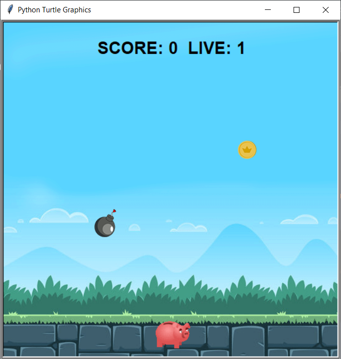
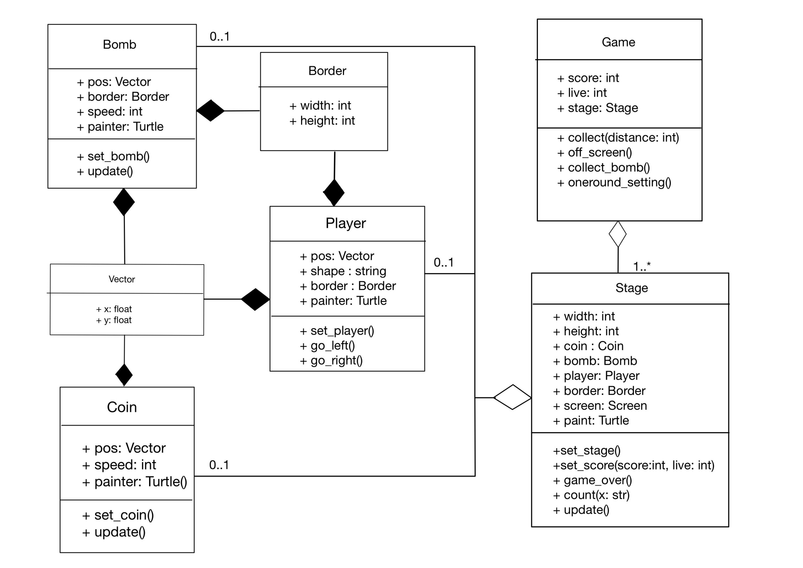

# Falling coin game

Falling coins game is the game that player has to move left and right to collect the coin that drop from the top.

### 

## GAME RULES
- if player can collect the coin score will be increase 10 points.
- if player collect bomb the score will be decrease 10 points.
- if player can't collect the coin player's live will be decrease 1 live.
- When player's live is 0 that mean the game is over.

## Project UML

## Program design

- class [`Vector`](vector.py)  creating various vector quantities used by the simulation
- class [`Border`](border.py)  create a border surrounding player, coin and bomb on the stage
- class [`Coin`](coin.py) creating coin 
- class [`Bomb`](bomb.py)  creating bomb
- class [`Player`](player.py) control the player to move to the left side and right side.
- class [`Stage`](screen.py) graphic on the stage
- class [`game`](runing.py) create and setting all object we use in one round

## Code structure 

1. [`vector.py`](vector.py)
This file contains the Vector class for creating various vector quantities used by the simulation.
   

2. [`border.py`](border.py)
This file contains the Border class for create a border surrounding player, coin and bomb on the stage.
   

3. [`coin.py`](coin.py)
This file contains the Coin class for creating coin objects with various physical properties such as position, speed(velocity).Each coin object knows how to update its own position.

4. [`bomb.py`](bomb.py)
This file contains the Bomb class for creating bomb objects with various physical properties such as position, speed(velocity) Each bomb object knows how to update its own position.
When drop of the screen,The bomb will random drop from the top of the border again. 

5. [`player.py`](player.py)
This file contains the Player class for creating player and control the player to move to the left side and right side.

6. [`stage.py`](screen.py)
This file contains the Stage class for graphic on the stage.

7. [`game.py`](runing.py)
This file contains the Game class fo create and setting all object we use in one round.

8. [`mainrunning.py`](MAINrunning.py)
This file imports all class we need in the game and use all the modules above in a graphical window.

   